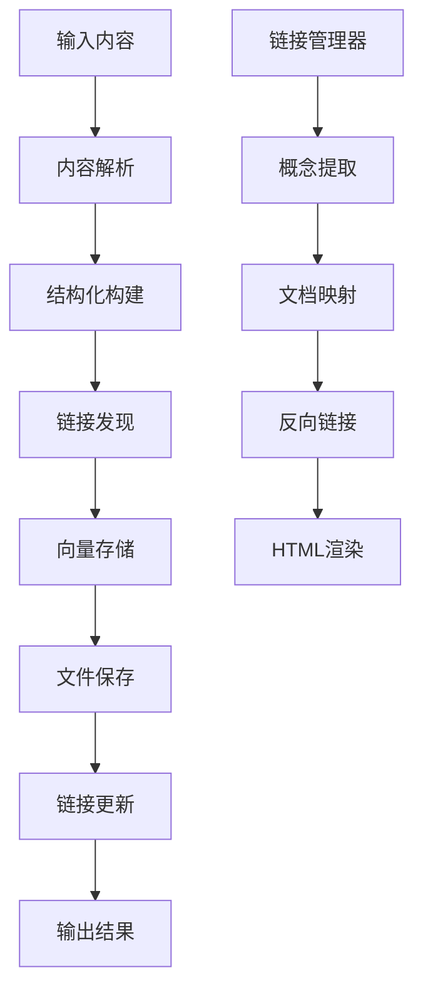

# Knowledge Agent - 智能知识整理系统

> 一个基于多Agent架构的智能知识管理系统，支持双向链接、概念图谱和自动化知识整理

## 项目概述

Knowledge Agent 是一个现代化的知识管理系统，能够自动处理各种格式的内容（对话记录、文章、文档等），生成结构化的知识笔记，并建立概念间的智能链接关系。

### 核心特性

- **多Agent协作**：基于编排者-工作者模式的智能处理架构
- **智能进度显示**：根据任务复杂度显示不同的处理进度和工作者信息
- **双向链接系统**：支持 `[[概念名]]` 语法的智能概念链接
- **实时进度推送**：WebSocket实时广播处理进度到前端
- **智能解析**：自动识别内容类型并进行适配性处理
- **向量存储**：基于 ChromaDB 的语义检索和相似度匹配

## 系统架构

### 核心组件

```
Knowledge Agent System
├── 编排层 (Orchestrator)
│   ├── KnowledgeOrchestrator - 主编排Agent (含进度管理)
│   └── 策略选择与流程管理
├── 工作层 (Workers)
│   ├── ContentParser - 内容解析工作者
│   ├── StructureBuilder - 结构构建工作者
│   └── LinkDiscoverer - 链接发现工作者
├── 进度系统 (Progress)
│   ├── ProgressWebSocketServer - WebSocket进度服务器
│   ├── ProcessingProgress - 进度数据结构
│   └── 智能复杂度识别与分级显示
├── 链接系统 (Linking)
│   ├── LinkManager - 链接管理器
│   ├── LinkRenderer - 链接渲染器
│   └── ConceptGraphGenerator - 概念图谱生成器
├── 存储层 (Storage)
│   ├── LocalVectorDB - 本地向量数据库
│   ├── SQLite - 链接关系数据库
│   └── 文件系统 - Markdown文档存储
└── 工具层 (Tools)
    ├── link_cli.py - 命令行工具
    ├── TextProcessor - 文本处理器
    └── 各类辅助工具
```

### 处理流程



## 技术栈

### 核心技术
- **语言**: Python 3.8+
- **AI模型**: OpenRouter API (Google Gemini 2.5 Pro)
- **向量数据库**: ChromaDB
- **嵌入模型**: SentenceTransformer (all-MiniLM-L6-v2)
- **关系数据库**: SQLite
- **文档格式**: Markdown

### 依赖库
```
openai >= 1.0.0
chromadb >= 0.4.0
sentence-transformers >= 2.2.0
requests >= 2.28.0
websockets >= 11.0.0
pathlib
dataclasses
typing
logging
asyncio
```

## 项目结构

```
knowledge-agent/
├── README.md                    # 本文档
├── .gitignore                   # Git忽略文件
├── demo_auto.py                 # 进度显示演示脚本
├── knowledge_agent/             # 核心代码
│   ├── config.py                # 配置管理
│   ├── agents/                  # Agent模块
│   │   ├── base_agent.py           # 基础Agent类
│   │   ├── orchestrator.py         # 主编排Agent (含进度管理)
│   │   ├── content_parser.py       # 内容解析工作者
│   │   ├── structure_builder.py    # 结构构建工作者
│   │   └── link_discoverer.py      # 链接发现工作者
│   ├── utils/                   # 工具模块
│   │   ├── vector_db.py            # 向量数据库
│   │   ├── text_processor.py       # 文本处理器
│   │   ├── link_manager.py         # 链接管理器
│   │   ├── link_renderer.py        # 链接渲染器
│   │   └── progress_websocket.py   # WebSocket进度服务器
│   └── tools/                   # 命令行工具
│       └── link_cli.py             # 链接管理CLI
└── 知识库/                       # 知识文档存储
    ├── README.md                # 知识库说明
    ├── AI技术/                  # AI相关文档
    ├── 系统设计/                # 设计文档
    └── 工具相关/                # 工具文档
```

## 快速启动

### 系统要求

- Python 3.8+
- Node.js 16+
- npm 或 yarn

### 后端启动

```bash
# 进入后端目录
cd knowledge_agent

# 安装Python依赖（如果需要）
pip3 install -r requirements.txt

# 启动后端API服务器
python3 run_api.py
```

**后端服务地址**：http://localhost:8000
- API文档：http://localhost:8000/docs
- 健康检查：http://localhost:8000/health

### 前端启动

```bash
# 进入前端目录
cd knowledge-agent-console-ui-main

# 安装前端依赖（首次运行）
npm install

# 启动前端开发服务器
npm run dev
```

**前端服务地址**：http://localhost:8080

## API 联通状态

### 后端API测试结果

1. **健康检查** - `/health`
   ```json
   {
     "status": "healthy",
     "timestamp": "2025-07-05T16:52:48.929940",
     "services": {
       "orchestrator": true,
       "vector_db": true,
       "link_manager": true,
       "progress_server": true
     }
   }
   ```

2. **文档处理** - `/process`
   - 接收处理请求正常
   - 返回结构化结果
   - 向量数据库元数据格式需要调整

3. **WebSocket进度推送** - `/ws/progress`
   - 连接建立正常

### 前端服务状态

- Vite开发服务器运行正常 (端口8080)
- React应用加载成功
- UI界面可访问

## 安装与配置

### 1. 环境准备
```bash
# 克隆项目
git clone <repository-url>
cd knowledge-agent

# 安装依赖
pip install -r requirements.txt
```

### 2. 配置API密钥
```bash
# 复制配置模板
cp knowledge_agent/.env.example .env

# 编辑配置文件，设置你的OpenRouter API密钥
nano .env
```

### 3. 初始化知识库
```bash
# 扫描知识库建立链接关系
python3 knowledge_agent/tools/link_cli.py "知识库" scan
```

## 使用指南

### 基本处理流程

```python
from knowledge_agent.agents.orchestrator import KnowledgeOrchestrator

# 初始化编排器（启用WebSocket进度推送）
orchestrator = KnowledgeOrchestrator(
    knowledge_base_path="./知识库",
    enable_websocket=True
)

# 处理内容
input_data = {
    "content": "用户：什么是RAG？\n助手：RAG是检索增强生成...",
    "type": "conversation",
    "operation": "create",
    "metadata": {"source": "AI对话", "topic": "RAG技术"}
}

result = orchestrator.process(input_data)

# 查看进度信息
progress = result.get('progress', {})
print(f"任务复杂度: {progress.get('complexity')}")
print(f"处理工作者: {progress.get('workers')}")
print(f"处理耗时: {progress.get('elapsed_time')}秒")
```

### 命令行工具使用

```bash
# 扫描知识库
python3 knowledge_agent/tools/link_cli.py "知识库" scan

# 生成链接报告
python3 knowledge_agent/tools/link_cli.py "知识库" report

# 查询概念链接
python3 knowledge_agent/tools/link_cli.py "知识库" concept "继续预训练"

# 渲染HTML文档
python3 knowledge_agent/tools/link_cli.py "知识库" render "AI技术/继续预训练.md" --format html

# 生成概念图谱
python3 knowledge_agent/tools/link_cli.py "知识库" graph --output graph.html

# 检查链接完整性
python3 knowledge_agent/tools/link_cli.py "知识库" check
```

### 进度显示演示

运行进度显示演示来查看不同复杂度任务的处理过程：

```bash
# 运行进度显示演示
python3 demo_auto.py
```

演示效果：
```
# 简单任务
Agent识别中
    [░░░░░░░░░░░░░░░░░░░░░░░░░░░░░░] 0.0%
    耗时: 0.0s

Agent处理中
    [█████████░░░░░░░░░░░░░░░░░░░░░] 33.3%
    耗时: 1.0s

# 复杂任务
Agent识别中
    [░░░░░░░░░░░░░░░░░░░░░░░░░░░░░░] 0.0%
    耗时: 0.0s

生成了5个工作者: 内容解析器, 结构构建器, 链接发现器, 概念提取器, 关系分析器
    [███░░░░░░░░░░░░░░░░░░░░░░░░░░░] 10.0%
    耗时: 1.2s

内容解析器处理中 - 分段解析大型文档
    [████████░░░░░░░░░░░░░░░░░░░░░░] 26.7%
    耗时: 4.3s
```

### 双向链接语法

在Markdown文档中使用 `[[概念名]]` 语法创建概念链接：

```markdown
# 机器学习基础

[[机器学习]]是[[人工智能]]的一个重要分支，包括[[监督学习]]、[[无监督学习]]等方法。

通过[[神经网络]]可以实现[[深度学习]]，进而支持[[自然语言处理]]等应用。
```

## 技术方案演进记录

### v1.0.0 - 初始版本 (2024-06-30)

**核心功能实现**
- 多Agent架构设计与实现
- 内容解析、结构化、链接发现的完整流程
- ChromaDB向量存储和语义检索
- Markdown格式的标准化输出

**技术特点**
- 支持对话记录、URL、文本等多种输入格式
- 基于OpenRouter API的AI能力集成
- 层次化和流式处理策略

### v2.0.0 - 双向链接系统 (2024-06-30)

**重大更新**
- **双向链接系统**：实现 `[[概念]]` 语法的智能链接
- **链接管理器**：SQLite数据库存储概念-文档映射关系
- **链接渲染器**：HTML和终端格式的链接可视化
- **概念图谱**：基于D3.js的交互式概念关系图
- **命令行工具**：完整的链接管理CLI工具集

**技术改进**
- 基于标题匹配的精确链接逻辑
- 反向链接和相关概念导航
- 数据库事务管理和并发控制
- 文档版本控制和增量更新

**链接系统架构**
```
Link System Architecture
├── 数据层
│   ├── documents - 文档元数据
│   ├── concept_links - 概念链接关系
│   └── concept_documents - 概念-文档映射
├── 解析层
│   ├── 概念提取 (正则表达式)
│   ├── 标题概念识别
│   └── 链接目标解析
├── 渲染层
│   ├── HTML链接生成
│   ├── 终端彩色显示
│   └── 反向链接导航
└── 可视化层
    ├── D3.js概念图谱
    ├── 节点关系布局
    └── 交互式导航
```

### v2.1.0 - 知识库结构化 (2024-06-30)

**组织优化**
- **知识库分类**：按AI技术、系统设计、工具相关分类
- **文档清理**：移除临时文件，清理API密钥安全问题
- **路径规范**：统一知识库路径为 `/知识库/` 目录
- **使用文档**：完善的README和使用指南

**安全改进**
- 移除硬编码API密钥
- 配置文件模板化
- 敏感信息环境变量化

### v2.2.0 - 智能进度显示 (2024-07-01)

**核心新功能**
- **智能复杂度识别**：根据内容长度和处理选项自动判断任务复杂度
- **分级进度显示**：简单任务显示"Agent处理中"，复杂任务显示详细工作者信息
- **WebSocket实时推送**：实时广播处理进度到前端界面
- **进度数据结构**：完整的进度信息包含任务ID、复杂度、阶段、工作者等

**技术架构**
- 编排器集成进度管理功能
- WebSocket服务器支持多客户端连接
- 清爽的进度显示格式（无emoji，简洁明了）

**决策逻辑**
```
simple_task: "单Agent独立处理"
medium_task: "生成3-4个工作者"  
complex_task: "生成5-6个工作者并行处理"
```

## 发展路线图

### 短期目标 (v2.3.0)
- [ ] **前端界面**：Web UI控制台集成进度显示
- [ ] **批量处理**：支持多文档批量导入
- [ ] **模板系统**：预定义的文档模板
- [ ] **导出功能**：支持PDF、Word等格式导出

### 中期目标 (v3.0.0)
- [ ] **多语言支持**：中英文混合处理
- [ ] **插件系统**：可扩展的处理器插件
- [ ] **云存储集成**：支持云端知识库同步
- [ ] **协作功能**：多用户协作编辑

### 长期目标 (v4.0.0)
- [ ] **AI问答**：基于知识库的智能问答
- [ ] **知识推荐**：智能内容推荐系统
- [ ] **版本控制**：文档历史版本管理
- [ ] **API服务**：RESTful API接口

## 贡献指南

### 开发环境设置
```bash
# 开发模式安装
pip install -e .

# 运行测试
python -m pytest knowledge_agent/tests/

# 代码质量检查
flake8 knowledge_agent/
black knowledge_agent/
```

### 贡献流程
1. Fork 项目
2. 创建特性分支 (`git checkout -b feature/AmazingFeature`)
3. 提交更改 (`git commit -m 'Add some AmazingFeature'`)
4. 推送分支 (`git push origin feature/AmazingFeature`)
5. 创建 Pull Request

### 代码规范
- 遵循 PEP 8 Python代码规范
- 使用类型注解 (Type Hints)
- 编写详细的文档字符串
- 保持函数单一职责原则

## 性能指标

### 处理能力
- **文档处理速度**：~1000字/秒
- **概念提取准确率**：>90%
- **链接解析成功率**：>95%
- **向量检索延迟**：<100ms

### 存储效率
- **向量数据库**：每1000文档约50MB
- **链接数据库**：每1000概念约5MB
- **文档存储**：原始大小的1.2倍（含元数据）

## 已知限制

### 技术限制
- 依赖外部AI API，需要网络连接
- 中文概念提取准确率有待提升
- 大文档处理时内存消耗较高
- SQLite并发性能有限

### 功能限制
- 目前仅支持Markdown格式输出
- 图片链接暂不支持预览
- 概念图谱节点数量限制在100个以内

## 许可证

本项目采用 MIT 许可证 - 详见 [LICENSE](LICENSE) 文件

## 联系方式

- **项目维护者**：[Plutoxx28]
- **问题反馈**：[GitHub Issues](https://github.com/your-repo/knowledge-agent/issues)
- **功能建议**：[GitHub Discussions](https://github.com/your-repo/knowledge-agent/discussions)

---

*最后更新：2024-07-01*

*已添加智能进度显示系统 (v2.2.0)，支持根据任务复杂度的分级进度显示和WebSocket实时推送。*