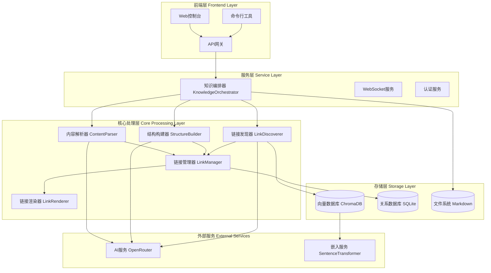
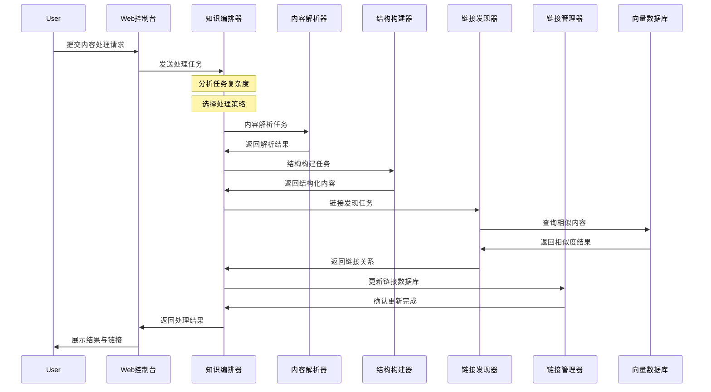

# Knowledge Agent 智能知识整理系统设计方案

> 基于多Agent架构的现代化知识管理系统 - 从概念到实现的完整技术方案

**版本**: v2.1.0  
**最后更新**: 2024-06-30  
**项目**: Knowledge Agent System

---

## 📋 系统概述

### 🎯 系统目标

构建一个基于多Agent架构的智能知识整理系统，实现以下核心能力：

- **🤖 智能内容处理**：自动处理AI对话记录、文章、文档等多种输入格式
- **🔗 双向链接系统**：支持 `[[概念名]]` 语法的智能概念链接和跳转
- **📊 知识图谱可视化**：构建交互式概念关系图谱
- **💾 向量语义检索**：基于语义相似度的智能文档检索
- **🌐 Web控制台**：现代化的前端操作界面
- **🔄 增量更新机制**：智能合并新旧内容，维护知识库一致性

### 🌟 核心价值主张

- **自动化处理**：减少90%的手动整理工作
- **智能链接发现**：自动建立概念间的关联关系
- **可视化导航**：通过图谱直观浏览知识结构
- **标准化输出**：统一的Markdown格式知识笔记
- **实时协作**：支持多用户场景下的知识库管理

## 🏗️ 系统架构

### 整体架构设计



### 🎭 Agent架构模式

采用 **编排者-工作者模式** (Orchestrator-Worker Pattern)：

```typescript
interface AgentArchitecture {
  orchestrator: {
    name: "KnowledgeOrchestrator",
    role: "主编排Agent",
    responsibilities: [
      "任务分析与策略选择",
      "工作者Agent协调",
      "流程监控与质量控制",
      "结果整合与输出"
    ]
  },
  workers: [
    {
      name: "ContentParser",
      role: "内容解析工作者",
      specialization: "多格式内容解析与清洗"
    },
    {
      name: "StructureBuilder", 
      role: "结构构建工作者",
      specialization: "标准化知识结构生成"
    },
    {
      name: "LinkDiscoverer",
      role: "链接发现工作者", 
      specialization: "概念关系识别与链接生成"
    }
  ]
}
```

### 🔄 处理流程



## 🤖 Agent详细设计

### 🎭 KnowledgeOrchestrator (主编排Agent)

```typescript
interface KnowledgeOrchestrator {
  core_responsibilities: {
    task_analysis: "解析输入内容，判断处理复杂度",
    strategy_selection: "选择最优处理策略",
    workflow_orchestration: "协调各工作者Agent执行",
    quality_control: "监控处理质量，确保输出标准",
    result_integration: "整合各Agent输出，生成最终结果"
  },
  
  processing_strategies: {
    standard: "适用于中等长度文档 (<10K字符)",
    hierarchical: "适用于长文档的层次化处理",
    streaming: "适用于序列化内容的流式处理",
    incremental: "适用于现有文档的增量更新"
  },
  
  decision_logic: {
    simple_task: "单Agent独立处理",
    medium_task: "生成3-4个工作者",
    complex_task: "生成5-6个工作者并行处理"
  }
}
```

**核心能力**：
- 智能任务分解与复杂度评估
- 动态工作者分配与负载均衡
- 实时进度监控与状态管理
- 自适应策略调整与错误恢复

### 🔍 ContentParser (内容解析工作者)

```typescript
interface ContentParser {
  supported_formats: [
    "conversation",    // AI对话记录
    "markdown",       // Markdown文档  
    "url",           // 网页链接
    "plain_text",    // 纯文本
    "file_upload"    // 文件上传
  ],
  
  parsing_capabilities: {
    format_detection: "自动识别内容格式类型",
    noise_filtering: "去除时间戳、格式符号等噪声",
    semantic_segmentation: "按主题和逻辑关系分段",
    importance_scoring: "为内容片段评估重要性权重"
  },
  
  processing_strategies: {
    conversation: "提取核心问答，过滤寒暄内容",
    academic: "识别摘要、关键概念、结论",
    technical: "提取操作步骤、配置参数、注意事项"
  }
}
```

**技术实现**：
- 正则表达式与NLP模型结合的格式识别
- 基于TF-IDF和语义嵌入的重要性评分
- 自适应分段算法，保持语义完整性

### 🏗️ StructureBuilder (结构构建工作者)

```typescript
interface StructureBuilder {
  core_functions: {
    concept_extraction: "识别并提取关键概念和定义",
    hierarchy_construction: "生成标题层级和逻辑结构", 
    format_standardization: "按既定格式要求标准化输出",
    tag_generation: "自动生成分类和主题标签"
  },
  
  output_format: {
    template: `
# 标题
## 文档信息
- **类型**: 文档类型
- **主题**: 主要主题
- **复杂度**: 复杂度等级

## 核心概念
- **[[概念名]]**: 概念定义和说明

## 主要内容
### 子标题
内容详述...

## 知识链接
[[前置概念]] → [[当前概念]] → [[后续概念]]

## 标签
#主题标签 #分类标签
`,
    
    concept_linking: "使用 [[概念名]] 语法创建双向链接",
    metadata_enrichment: "添加文档元数据和统计信息"
  }
}
```

**质量保证**：
- 概念定义的准确性验证
- 标题层级的逻辑一致性检查
- Markdown语法的格式规范性校验

### 🔗 LinkDiscoverer (链接发现工作者)

```typescript
interface LinkDiscoverer {
  discovery_methods: {
    semantic_similarity: "基于向量相似度的概念匹配",
    co_occurrence: "基于文本共现的关系发现",
    hierarchical_relations: "识别包含、属于等层级关系",
    causal_relations: "识别导致、影响等因果关系"
  },
  
  relationship_types: {
    hierarchical: "父子概念、分类关系",
    causal: "原因结果、条件依赖", 
    parallel: "同级概念、对比关系",
    reference: "支撑证据、案例说明"
  },
  
  linking_pipeline: {
    concept_matching: "与现有知识库概念进行匹配",
    similarity_computation: "计算语义相似度分数",
    relationship_identification: "识别概念间关系类型",
    link_generation: "生成双向链接和引用"
  }
}
```

**算法核心**：
- 基于SentenceTransformer的语义嵌入匹配
- 余弦相似度计算与阈值过滤
- 图论算法优化链接网络结构

## 🔗 双向链接系统

### 核心架构

```typescript
interface LinkingSystem {
  components: {
    LinkManager: "链接关系管理与存储",
    LinkRenderer: "链接可视化渲染",
    ConceptGraphGenerator: "概念图谱生成"
  },
  
  data_models: {
    ConceptLink: {
      concept_name: string,
      source_doc: string,
      target_doc: string | null,
      line_number: number,
      context: string,
      created_at: string
    },
    
    DocumentMeta: {
      doc_path: string,
      title: string,
      concepts: string[],
      outbound_links: string[],
      inbound_links: string[],
      last_updated: string,
      file_hash: string
    }
  }
}
```

### 🗄️ 数据库设计

```sql
-- 文档元数据表
CREATE TABLE documents (
    doc_path TEXT PRIMARY KEY,
    title TEXT,
    concepts TEXT,      -- JSON array
    outbound_links TEXT, -- JSON array  
    inbound_links TEXT,  -- JSON array
    last_updated TEXT,
    file_hash TEXT
);

-- 概念链接表
CREATE TABLE concept_links (
    id INTEGER PRIMARY KEY AUTOINCREMENT,
    concept_name TEXT,
    source_doc TEXT,
    target_doc TEXT,
    line_number INTEGER,
    context TEXT,
    created_at TEXT,
    FOREIGN KEY (source_doc) REFERENCES documents (doc_path)
);

-- 概念-文档映射表
CREATE TABLE concept_documents (
    concept_name TEXT,
    doc_path TEXT,
    is_primary BOOLEAN,  -- 是否是该概念的主文档
    PRIMARY KEY (concept_name, doc_path)
);
```

### 🎨 链接渲染策略

#### HTML渲染
```typescript
interface HTMLRenderingStrategy {
  concept_links: {
    found_target: `<a href="{target_doc}" class="concept-link" 
                     data-concept="{concept_name}" 
                     title="跳转到: {concept_name}">{concept_name}</a>`,
                     
    missing_target: `<span class="concept-link-missing" 
                           data-concept="{concept_name}" 
                           title="未找到文档: {concept_name}">{concept_name}</span>`
  },
  
  navigation_features: {
    backlinks: "显示引用当前文档的其他文档",
    related_concepts: "显示相关概念和链接路径",
    concept_preview: "悬浮预览概念定义"
  }
}
```

#### 匹配逻辑
```typescript
interface LinkMatchingLogic {
  matching_strategy: "基于标题的精确匹配",
  
  title_extraction: {
    pattern: "从文档标题提取核心概念名",
    cleanup: "移除'技术详解'、'指南'等修饰词",
    normalization: "统一大小写和标点符号"
  },
  
  target_resolution: {
    primary_match: "优先匹配标题概念完全一致的文档",
    fallback: "查找标题包含该概念的文档",
    strict_policy: "只为真正存在的概念文档创建链接"
  }
}
```

## 📊 知识图谱系统

### 图谱架构

```typescript
interface ConceptGraphSystem {
  graph_elements: {
    nodes: {
      concept_nodes: "概念节点 - 蓝色圆形",
      document_nodes: "文档节点 - 绿色方形"
    },
    edges: {
      concept_links: "概念间链接关系",
      document_links: "文档间引用关系"
    }
  },
  
  visualization: {
    library: "D3.js + React",
    layouts: ["force-directed", "circular", "hierarchical"],
    interactions: ["zoom", "pan", "drag", "click", "hover"],
    features: ["search", "filter", "highlight", "export"]
  },
  
  analytics: {
    centrality_analysis: "识别核心概念",
    community_detection: "发现概念聚类",
    path_analysis: "概念间关联路径",
    influence_scoring: "概念影响力评分"
  }
}
```

### 可视化特性

- **交互式导航**：点击节点查看详细信息
- **动态过滤**：按类型、重要性、时间过滤节点
- **路径高亮**：显示概念间的关联路径
- **聚类分析**：自动识别概念群组
- **实时更新**：支持图谱的增量更新

## 💾 存储架构

### 多层存储设计

```typescript
interface StorageArchitecture {
  vector_storage: {
    technology: "ChromaDB",
    purpose: "语义检索和相似度匹配",
    data: {
      documents: "文档内容向量",
      concepts: "概念定义向量"
    },
    embedding_model: "all-MiniLM-L6-v2"
  },
  
  relational_storage: {
    technology: "SQLite",
    purpose: "链接关系和元数据管理",
    optimizations: [
      "WAL模式避免锁定",
      "索引优化查询性能",
      "事务保证数据一致性"
    ]
  },
  
  file_storage: {
    format: "Markdown",
    structure: "知识库分类目录",
    versioning: "Git版本控制",
    backup: "自动备份机制"
  }
}
```

### 数据一致性保证

- **ACID事务**：确保链接关系的原子性更新
- **版本控制**：Git跟踪文档变更历史
- **增量同步**：只处理变化的内容部分
- **冲突解决**：智能合并策略处理并发修改

## 🎨 前端架构

### 技术栈

```typescript
interface FrontendArchitecture {
  framework: "React 18 + TypeScript",
  styling: "TailwindCSS + shadcn/ui",
  state_management: "Zustand",
  data_fetching: "TanStack Query",
  routing: "React Router v6",
  build_tool: "Vite",
  
  core_modules: {
    processing_hub: "内容处理控制中心",
    knowledge_base: "知识库文档管理",
    concept_graph: "概念图谱可视化",
    settings: "系统配置管理"
  },
  
  real_time: {
    websocket: "处理进度实时推送",
    sse: "系统状态更新",
    polling: "降级方案"
  }
}
```

### 核心组件设计

#### 处理控制台
- **多输入支持**：文本、对话、URL、文件上传
- **实时进度**：WebSocket驱动的进度条
- **配置面板**：处理策略和参数调整
- **结果预览**：Markdown渲染和链接高亮

#### 知识库管理
- **文档列表**：搜索、过滤、排序、批量操作
- **分类管理**：按主题组织文档结构
- **链接分析**：查看文档的链接关系
- **导入导出**：支持多种格式转换

#### 概念图谱
- **D3.js可视化**：力导向图布局
- **交互操作**：缩放、拖拽、点击导航
- **智能过滤**：按类型、权重、时间过滤
- **路径分析**：概念间关联路径展示

## 🔄 长文本处理策略

### 层次化处理 (Hierarchical Processing)

```typescript
interface HierarchicalProcessing {
  core_principle: "按语义和结构层次分解处理",
  
  processing_levels: {
    macro_level: "整体大纲、主要概念、核心主题",
    meso_level: "各章节详细内容和概念关系", 
    micro_level: "具体细节、例子和补充说明"
  },
  
  context_propagation: {
    top_down: "上级处理结果作为下级背景信息",
    consistency: "保持概念定义的一致性",
    connectivity: "维护章节间的逻辑关联"
  },
  
  适用场景: [
    "学术论文：摘要→引言→方法→结果→讨论→结论",
    "技术文档：概述→详细说明→实现细节→示例",
    "书籍章节：章节概述→小节详情→具体内容"
  ]
}
```

### 流式处理 (Streaming Processing)

```typescript
interface StreamingProcessing {
  core_principle: "滑动窗口技术，实时处理文档片段",
  
  sliding_window: {
    window_size: "3000字符（固定）",
    overlap_size: "500字符（防止语义断裂）",
    dynamic_adjustment: "基于内容复杂度动态调整"
  },
  
  state_maintenance: {
    concept_continuity: "概念抽取的连续性跟踪",
    term_consistency: "关键术语的一致性维护",
    context_update: "上下文关系的实时更新"
  },
  
  incremental_fusion: {
    content_merging: "新内容与已处理内容的智能合并",
    deduplication: "重复信息的自动去重",
    conflict_resolution: "矛盾信息的冲突解决"
  }
}
```

### 智能策略选择

```typescript
interface StrategySelection {
  automatic_selection: {
    document_type: {
      structured: "论文、报告 → 层次化处理",
      sequential: "对话、日志 → 流式处理", 
      hybrid: "混合文档 → 组合策略"
    },
    
    complexity_assessment: {
      factors: ["文档长度", "结构复杂度", "概念密度"],
      dynamic_parameters: "基于评估结果调整处理参数"
    }
  },
  
  quality_assurance: {
    process_monitoring: "处理过程实时监控",
    integrity_verification: "内容完整性验证",
    semantic_consistency: "语义一致性检查"
  }
}
```

## ⚙️ API设计

### RESTful API规范

```typescript
interface APIEndpoints {
  // 内容处理
  "POST /api/process": {
    description: "提交内容处理任务",
    request: ProcessingInput,
    response: ProcessingResult
  },
  
  "GET /api/process/{taskId}/status": {
    description: "查询处理进度",
    response: ProcessingStatus
  },
  
  // 知识库管理
  "GET /api/documents": {
    description: "获取文档列表",
    query_params: ["page", "size", "category", "search"],
    response: DocumentList
  },
  
  "GET /api/documents/{id}": {
    description: "获取文档详情",
    response: DocumentDetail
  },
  
  // 链接系统
  "POST /api/links/scan": {
    description: "扫描知识库更新链接",
    response: ScanResult
  },
  
  "GET /api/links/report": {
    description: "获取链接分析报告",
    response: LinkReport
  },
  
  // 概念图谱
  "GET /api/graph": {
    description: "获取概念图谱数据",
    query_params: ["max_nodes", "filter_type"],
    response: GraphData
  }
}
```

### WebSocket事件

```typescript
interface WebSocketEvents {
  // 客户端 → 服务端
  client_events: {
    "subscribe-processing": "订阅处理进度更新",
    "subscribe-system": "订阅系统状态更新"
  },
  
  // 服务端 → 客户端  
  server_events: {
    "processing-progress": ProcessingProgress,
    "processing-complete": ProcessingResult,
    "processing-error": ErrorInfo,
    "system-status": SystemStatus
  }
}
```

## 🧪 测试策略

### 测试金字塔

```typescript
interface TestingStrategy {
  unit_tests: {
    coverage_target: ">80%",
    focus: ["Agent逻辑", "链接算法", "数据处理"],
    tools: ["Pytest", "Jest", "Vitest"]
  },
  
  integration_tests: {
    coverage_target: ">60%", 
    focus: ["API集成", "数据库操作", "文件处理"],
    tools: ["Supertest", "TestContainers"]
  },
  
  e2e_tests: {
    coverage: "核心流程100%",
    scenarios: [
      "完整的内容处理流程",
      "链接系统的扫描更新",
      "前端用户交互"
    ],
    tools: ["Playwright", "Cypress"]
  }
}
```

### 性能测试

```typescript
interface PerformanceTargets {
  processing_speed: "~1000字/秒",
  concept_extraction: ">90%准确率",
  link_resolution: ">95%成功率", 
  vector_search: "<100ms延迟",
  
  load_testing: {
    concurrent_users: 50,
    concurrent_processing: 10,
    max_document_size: "10MB"
  }
}
```

## 🚀 部署架构

### 容器化部署

```yaml
# docker-compose.yml
version: '3.8'
services:
  frontend:
    build: ./frontend
    ports:
      - "3000:3000"
    environment:
      - VITE_API_BASE_URL=http://backend:8000
      
  backend:
    build: ./knowledge_agent
    ports:
      - "8000:8000"
    environment:
      - OPENROUTER_API_KEY=${OPENROUTER_API_KEY}
      - DATABASE_URL=sqlite:///data/knowledge.db
    volumes:
      - ./data:/app/data
      - ./知识库:/app/knowledge_base
      
  chroma:
    image: chromadb/chroma:latest
    ports:
      - "8001:8000"
    volumes:
      - ./chroma_data:/chroma/chroma
```

### CI/CD流水线

```yaml
# .github/workflows/ci.yml
name: CI/CD Pipeline
on: [push, pull_request]

jobs:
  test:
    runs-on: ubuntu-latest
    steps:
      - uses: actions/checkout@v3
      - name: Run Backend Tests
        run: |
          cd knowledge_agent
          python -m pytest tests/ --cov=./ --cov-report=xml
      - name: Run Frontend Tests  
        run: |
          cd frontend
          npm test -- --coverage
          
  build:
    needs: test
    runs-on: ubuntu-latest
    steps:
      - name: Build Docker Images
        run: |
          docker build -t knowledge-agent:${{ github.sha }} .
      - name: Push to Registry
        run: |
          docker push knowledge-agent:${{ github.sha }}
          
  deploy:
    needs: build
    runs-on: ubuntu-latest
    if: github.ref == 'refs/heads/main'
    steps:
      - name: Deploy to Production
        run: |
          # 部署脚本
```

## 📊 监控与运维

### 系统监控

```typescript
interface MonitoringStack {
  metrics: {
    application: "Prometheus + Grafana",
    logs: "ELK Stack (Elasticsearch + Logstash + Kibana)",
    tracing: "Jaeger",
    uptime: "Uptimerobot"
  },
  
  key_metrics: [
    "处理任务成功率",
    "平均处理时长", 
    "概念提取准确率",
    "链接解析成功率",
    "API响应时间",
    "系统资源使用率"
  ],
  
  alerting: {
    error_rate: ">5% 触发告警",
    response_time: ">2秒 触发告警",
    system_resources: ">80% 触发告警"
  }
}
```

### 日志策略

```typescript
interface LoggingStrategy {
  log_levels: {
    ERROR: "系统错误、处理失败",
    WARN: "性能问题、资源不足",
    INFO: "业务操作、状态变更",
    DEBUG: "详细执行过程"
  },
  
  structured_logging: {
    format: "JSON",
    fields: ["timestamp", "level", "module", "message", "context"],
    correlation_id: "跨服务请求追踪"
  },
  
  log_aggregation: {
    centralized: "ELK Stack集中收集",
    retention: "30天数据保留",
    search: "全文检索和过滤"
  }
}
```

## 🛣️ 发展路线图

### 短期目标 (Q3 2024)

```typescript
interface ShortTermGoals {
  frontend_enhancement: {
    web_console: "完整的Web控制台界面",
    real_time_updates: "WebSocket实时进度推送",
    batch_processing: "支持多文档批量处理",
    export_features: "PDF、Word等格式导出"
  },
  
  performance_optimization: {
    caching: "智能缓存机制",
    parallel_processing: "并行处理优化",
    index_optimization: "向量索引性能提升"
  }
}
```

### 中期目标 (Q4 2024)

```typescript
interface MediumTermGoals {
  collaboration: {
    multi_user: "多用户协作支持",
    permission_system: "细粒度权限控制",
    version_control: "文档版本管理",
    conflict_resolution: "协作冲突解决"
  },
  
  intelligence_enhancement: {
    personalization: "个性化推荐算法",
    auto_tagging: "智能标签生成",
    quality_scoring: "内容质量评分",
    trend_analysis: "知识趋势分析"
  }
}
```

### 长期目标 (2025)

```typescript
interface LongTermGoals {
  advanced_features: {
    qa_system: "基于知识库的智能问答",
    recommendation: "智能内容推荐系统", 
    analytics: "知识分析和洞察",
    api_ecosystem: "开放API生态"
  },
  
  enterprise_features: {
    sso_integration: "企业SSO集成",
    audit_logging: "审计日志系统",
    compliance: "数据合规性支持",
    scalability: "企业级扩展性"
  }
}
```

## 📈 性能指标

### 核心KPI

```typescript
interface PerformanceKPIs {
  processing_efficiency: {
    speed: "1000+ 字符/秒",
    accuracy: "90%+ 概念提取准确率",
    success_rate: "95%+ 处理成功率"
  },
  
  system_performance: {
    response_time: "<100ms API响应", 
    throughput: "100+ 并发用户",
    availability: "99.9% 系统可用性"
  },
  
  user_experience: {
    loading_time: "<3秒 页面加载",
    processing_feedback: "实时进度反馈",
    error_recovery: "智能错误恢复"
  },
  
  storage_efficiency: {
    vector_db: "50MB/1000文档",
    relation_db: "5MB/1000概念", 
    compression_ratio: "1.2x 原始大小"
  }
}
```

## 🔒 安全考虑

### 安全架构

```typescript
interface SecurityArchitecture {
  authentication: {
    methods: ["JWT Token", "OAuth 2.0", "API Key"],
    session_management: "安全会话管理",
    password_policy: "强密码策略"
  },
  
  authorization: {
    rbac: "基于角色的访问控制",
    resource_permissions: "细粒度资源权限",
    api_rate_limiting: "API访问频率限制"
  },
  
  data_protection: {
    encryption: {
      at_rest: "静态数据AES-256加密",
      in_transit: "传输数据TLS 1.3加密",
      key_management: "安全密钥管理"
    },
    privacy: {
      data_anonymization: "敏感数据匿名化",
      retention_policy: "数据保留策略",
      gdpr_compliance: "GDPR合规性"
    }
  },
  
  api_security: {
    input_validation: "严格输入验证",
    sql_injection: "SQL注入防护",
    xss_protection: "XSS攻击防护",
    csrf_protection: "CSRF攻击防护"
  }
}
```

## 📝 总结

Knowledge Agent智能知识整理系统基于现代多Agent架构和双向链接技术，提供了完整的知识管理解决方案：

### 🎯 核心优势

1. **智能化程度高**：全自动处理，大幅减少人工干预
2. **架构设计先进**：模块化Agent设计，易于扩展和维护  
3. **用户体验优秀**：现代化Web界面，直观的操作流程
4. **技术栈现代化**：采用最新的技术栈和最佳实践
5. **可扩展性强**：支持企业级部署和定制化需求

### 🚀 创新特性

- **双向链接系统**：真正可点击跳转的概念链接
- **概念图谱可视化**：交互式知识网络导航
- **智能处理策略**：自适应选择最优处理方案
- **实时协作支持**：多用户场景下的知识库管理
- **全栈技术整合**：从AI处理到前端展示的完整闭环

### 📈 预期价值

通过实施本系统，预期能够：
- **提升90%+的知识整理效率**
- **建立标准化的知识管理流程**
- **促进知识的发现和重用**
- **支撑团队的协作和学习**

本设计方案为Knowledge Agent系统提供了清晰的技术路径和实施指南，确保项目能够成功交付并持续演进。

---

**文档状态**: ✅ 已完成  
**下次更新**: 根据实施进展和技术演进更新  
**维护者**: Plutoxx28